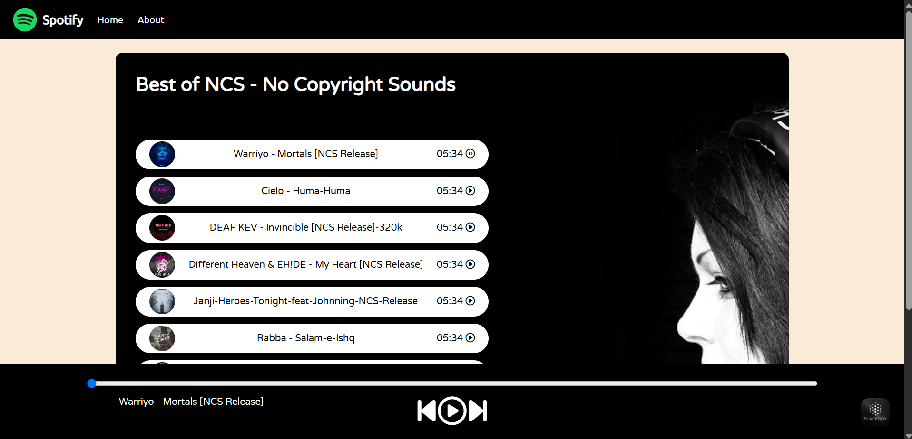
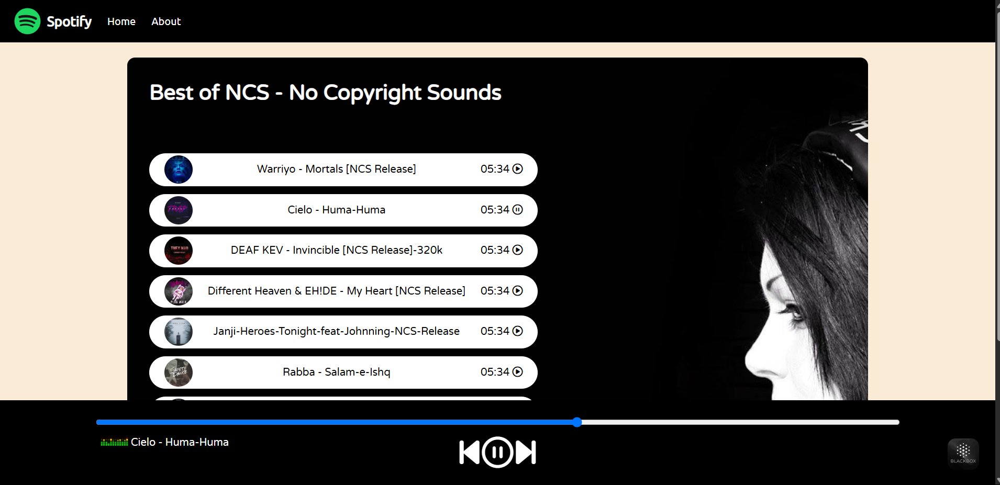

# spotifyClone---Basic-Frontend-Clone
🎧 Spotify Clone (Basic Web Version) This is a basic frontend clone of Spotify, built using pure HTML, CSS, and JavaScript. It mimics the look and functionality of a music streaming app with features like play/pause, next/previous track controls, progress bar, and a dynamic playlist UI — all without using any external frameworks.
---

## 📸 Screenshots

### 🔻 Home UI  


### 🔻 Music Player Active  


> Add your actual screenshots in the `screenshots/` folder and update the image paths accordingly.

---

## 🧩 Features

- 🎵 Preloaded playlist with 10 songs
- ▶️ Play / Pause / Next / Previous controls
- 🎧 Live song title and cover update on play
- ⏱️ Seekbar control to change playback position
- 📱 Responsive layout (basic support)
- 🖼️ Custom album art and GIF animation while playing

---

## 💻 Tech Stack

- **HTML5** – Layout structure
- **CSS3** – Styling and UI responsiveness
- **JavaScript (Vanilla)** – Audio control, DOM interactions
- **Font Awesome** – Media control icons

---## 📁 Folder Structure

spotify-clone/
├── index.html # Main HTML file
├── style.css # Custom styles
├── script.js # JavaScript logic for music player
├── songs/ # MP3 files for demo
├── covers/ # Song cover images
├── screenshots/ # Screenshots for README (optional)
├── bg.jpg # Background image
└── logo.png # Spotify logo

---

## 🚀 How to Run Locally

1. **Clone the repository**
   ```bash
   git clone https://github.com/ankitkumarsinha6/spotifyClone---Basic-Frontend-Clone.git
   cd spotify-clone
Open index.html in your browser

bash
Copy
Edit
# You can simply double-click the file OR use Live Server in VS Code

⚠️ Disclaimer
This is a frontend-only clone created for educational/demo purposes.

It does not use Spotify's real API or support real-time streaming.

Songs are stored locally in the songs/ folder.

🙌 Contributions
Feel free to fork the project and submit a pull request with improvements! Suggestions and stars ⭐ are always welcome.

📬 Contact
Made with ❤️ by Ankit Kumar Sinha
📧 ankitkumarsinha6@gmail.com
🌐 Portfolio or LinkedIn
